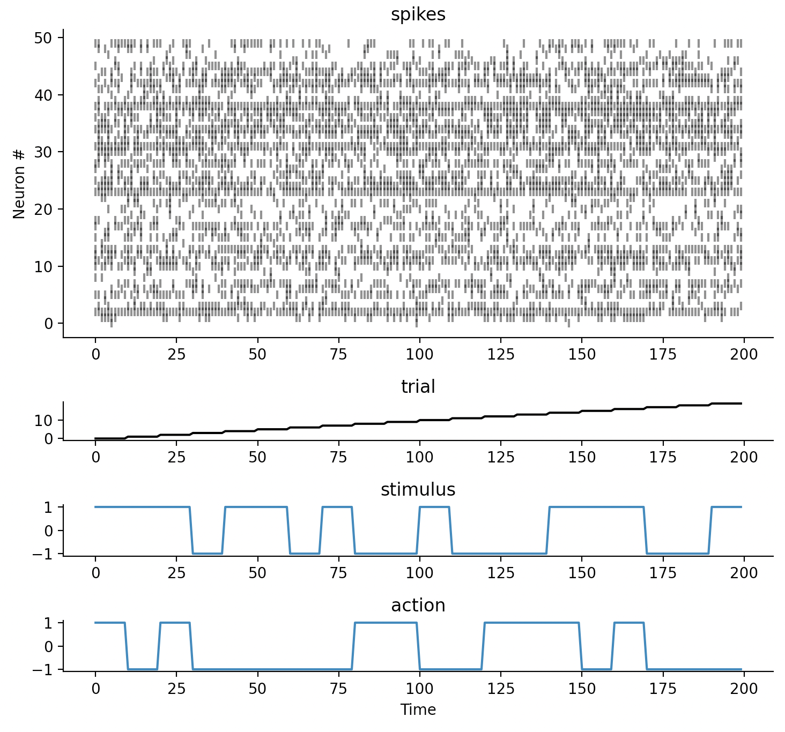
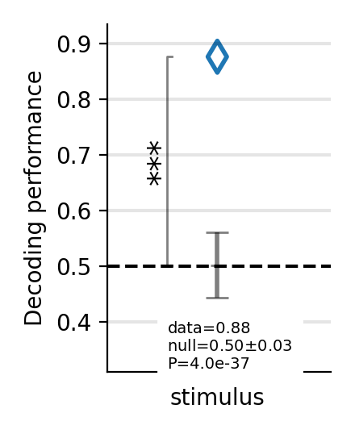
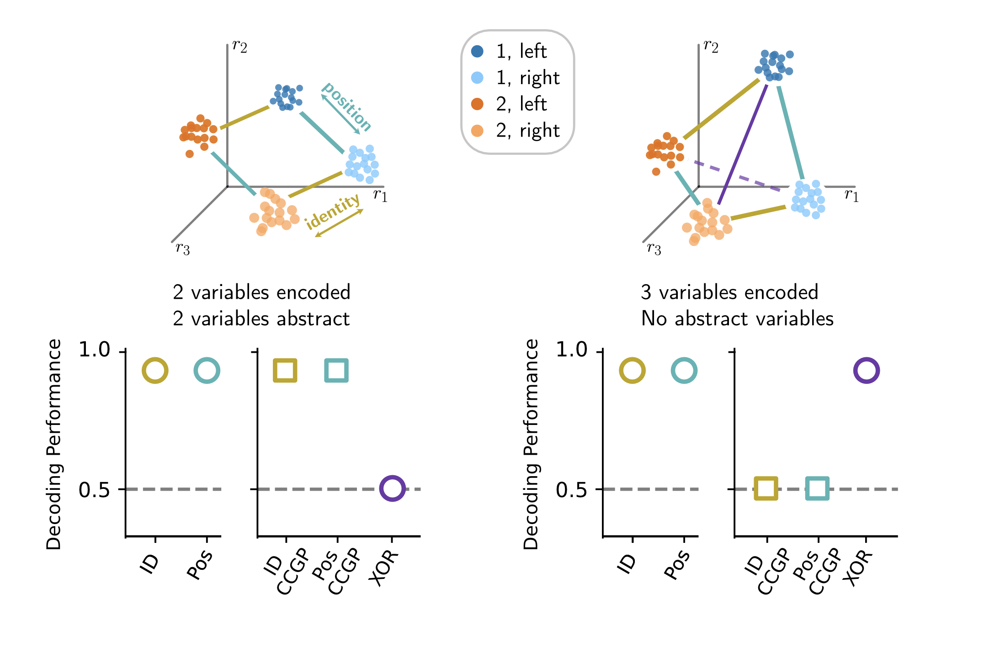
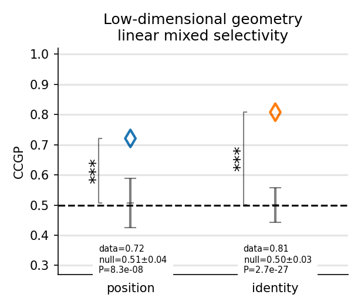

# Decodanda

[](https://www.gnu.org/licenses/gpl-3.0)
[](https://decodanda.readthedocs.io/en/latest/index.html)


Decodanda ([dog-latin](https://en.wikipedia.org/wiki/Dog_Latin) for "to be decoded") 
is a Python package for decoding and geometrical analysis of neural activity.

Decodanda is designed to expose a user-friendly and flexible interface for population 
activity decoding, avoiding the most common pitfalls by a series of built-in best practices:

- Cross-validation is automatically implemented using a default or specified trial structure
- All analyses come with a built-in null model to test the significance of the data performance ([notebook](https://github.com/lposani/decodanda/blob/master/notebooks/single_var_decoding.ipynb))
- Multi-sessions pooling to create pseudo-populations is supported out of the box ([notebook](https://github.com/lposani/decodanda/blob/master/notebooks/pseudopopulation_decoding.ipynb))
- The individual contributions of multiple correlated experimental variables are isolated by cross-variable data balancing, avoding the confounding effects of correlated variables ([notebook](https://github.com/lposani/decodanda/blob/master/notebooks/disentangling_confounds.ipynb))

In addition, Decodanda exposes a series of functions to compute the 
Cross-Condition Generalization Performance (_CCGP_, Bernardi et al. 2020) 
for the geometrical analysis of neural population activity ([notebook](https://github.com/lposani/decodanda/blob/notebooks/master/CCGP.ipynb)).

Please refer to the [notebooks](https://github.com/lposani/decodanda/blob/master/notebooks) for some examples on
- [single-variable decoding](https://github.com/lposani/decodanda/blob/master/notebooks/single_var_decoding.ipynb) (with null model) [](https://colab.research.google.com/github/lposani/decodanda/blob/master/notebooks/single_var_decoding.ipynb)
- [multi-variable decoding](https://github.com/lposani/decodanda/blob/master/notebooks/disentangling_confounds.ipynb) (disentangling correlated variables) [](https://colab.research.google.com/github/lposani/decodanda/blob/master/notebooks/disentangling_confounds.ipynb)
- [pseudo-population decoding](https://github.com/lposani/decodanda/blob/master/notebooks/pseudopopulation_decoding.ipynb) (pooling neurons from multiple data sets) [](https://colab.research.google.com/github/lposani/decodanda/blob/master/notebooks/pseudopopulation_decoding.ipynb)
- [decoding in time](https://github.com/lposani/decodanda/blob/master/notebooks/decoding_in_time.ipynb) [](https://colab.research.google.com/github/lposani/decodanda/blob/master/notebooks/decoding_in_time.ipynb)
- [CCGP and geometrical analysis](https://github.com/lposani/decodanda/blob/notebooks/master/CCGP.ipynb) [](https://colab.research.google.com/github/lposani/decodanda/blob/master/notebooks/CCGP.ipynb)

For a guided explanation of some of the best practices implemented by Decodanda, you can refer to [my teaching material](https://tinyurl.com/ArtDecod) for the Advanced Theory Course in Neuroscience at Columbia University.

If you are interested in collaborating or contributing to the project, get in touch with me through [this module](https://forms.gle/iifpsAAPuRBbYzxJ6) or shoot me an old-fashioned email!.


Have fun, drink water, and decode safely!
## Getting started

### Install
<hr>
Decodanda can be installed via pip:

```bash
pip install decodanda
```

Alternatively, to install Decodanda locally, run

```bash
python3 setup.py install
```

from the home folder of the package. It is recommended to use a [virtual environment](https://packaging.python.org/en/latest/tutorials/installing-packages/#creating-and-using-virtual-environments) to manage packages and dependencies.

### Documentation
Visit [https://decodanda.readthedocs.io](https://decodanda.readthedocs.io/en/latest/modules.html) for the complete documentation.


### Data structure
<hr>
Decodanda works with datasets organized into Python dictionaries. 
For N recorded neurons and T trials (or time bins), the data dictionary must contain:

1. a ```TxN``` array, under the ```raster``` key

This is the set of features we use to decode. Can be continuous (e.g., calcium fluorescence) or discrete (e.g., spikes) values.
  
2. a ```Tx1``` array specifying a ```trial``` number

This array will define the subdivisions for cross validation: trials (or time bins) that share the
same ```trial``` value will always go together in either training or testing samples.

    
3. a ```Tx1``` array for each variable we want to decode

Each value will be used as a label for the ```raster``` feature. Make sure these arrays are
synchronized with the ```raster``` array.

    

A properly-formatted data set with two experimental variables (here, _stimulus_ and _action_) would look like this:
```python
data = {
    'raster': [[0, 1, ..., 0], ..., [0, 0, ..., 1]],   # <TxN array>, neural activations 
    'trial':  [0, 0, 0, ..., T],                       # <Tx1 array>, trial number
    'stimulus': [-1, -1, 1, ..., 1],                   # <Tx1 array>, binary labels for stimulus
    'action': [1, -1, 1, ..., -1],                     # <Tx1 array>, binary labels for action
}
```



## Use cases

### Decoding one variable from neural activity
<hr>

([Notebook](https://github.com/lposani/decodanda/blob/master/notebooks/single_var_decoding.ipynb))


All decoding functions are implemented as methods of the ```Decodanda``` class. 
The constructor of this class takes two main objects:

- ```data```: a single dictionary, or a list of dictionaries, containing the data to analyze. 
In the case of N neurons and T trials (or time bins), each data dictionary must contain:
  - the **neural data**: 
  
    ```TxN``` array, under the ```raster``` key (you can specify a different one)
  - the **values of the variables** we want to decode

    ```Tx1``` array per variable
  - the **trial** number (independent samples for cross validation): 
     
    ```Tx1``` array


- ```conditions```: a dictionary specifying what variable(s) and what values we want to decode from the data.

For example, if we want to decode the variable ```stimulus```, which takes values ```A, B``` from simultaneous recordings of N neurons x T trials we will have:
```python
from decodanda import Decodanda

data = {
    'raster': [[0, 1, ..., 0], ..., [0, 0, ..., 1]],   # <TxN array>, neural activations 
    'stimulus': ['A', 'A', 'B', ..., 'B'],             # <Tx1 array>, labels
    'trial':  [1, 2, 3, ..., T],                       # <Tx1 array>, trial number
}

conditions = {
    'stimulus': ['A', 'B']
}

dec = Decodanda(
        data=data,
        conditions=conditions)

```

To perform the cross-validated decoding analysis for `stimulus`, call the ```decode()``` method

```python
performances, null = dec.decode(
                        training_fraction=0.5,  # fraction of trials used for training
                        cross_validations=10,   # number of cross validation folds
                        nshuffles=20)           # number of null model iterations
```
which outputs
```text
>>> performances
{'stimulus': 0.78}  # mean decoding performance over the cross_validations folds
>>> null
{'stimulus' [0.52, 0.49, 0.54 ... 0.49]}  # nshuffles (20) values
```
If ```plot=true``` is specified in ```decode()```, the function will show the performance compared
to the null model (with errorbars spanning 2 STDs) and a significance notation based on the z-score:




<br/>

### Decoding multiple variables and disentangling confounds
<hr>

([Notebook](https://github.com/lposani/decodanda/blob/master/notebooks/disentangling_confounds.ipynb))

It often happens that different conditions in an experiment are correlated to each other. 
For example, in a simple stimulus to action association task (```stimulus: A``` -> ```action: left```; ```stimulus: B``` -> ```action: right```), the action performed by a trained subject would clearly be correlated to the presented stimulus.

This correlation makes it hard to drawn conclusions from the results of a decoding analysis, as a good performance for one variable could in fact be due to the recorded activity responding to the other variable: in the example above, one would be able to decode ```action``` from a brain region that only represents ```stimulus```, and viceversa.

To disentangle variables from each other and avoid the confounding effect of correlated conditions, Decodanda implements a multi-variable balanced sampling in the ```decode()``` function.
In practice, the traning and testing data are sampled by making sure that all the values of the other variables are balanced. 

Taking from the example above, the ```decode()``` function will first create training and testing data for ```stimulus: A``` and ```stimulus: B```, each containing a 50%-50% mix of ```action: left``` and ```action: right```. 
It will then run the cross-validated decoding analysis as explained above.
The result will therefore be informative on whether the recorded activity responds to the variable ```stimulus``` alone, independently on ```action```.

To make Decodanda balance two or more variables, the ```conditions``` dictionary must contain two or more ```key: values``` associations, each representing a variable name and its two values.

```python
from decodanda import Decodanda

data = {
    'raster': [[0, 1, ..., 0], ..., [0, 0, ..., 1]],   # <TxN array>, neural activations 
    'stimulus': ['A', 'A', 'B', ..., 'B'],             # <Tx1 array>, values of the stimulus variable
    'action': ['left', 'left', 'right', ..., 'left'],  # <Tx1 array>, values of the action variable
    'trial':  [1, 2, 3, ..., T],                       # <Tx1 array>, trial number
}

conditions = {
    'stimulus': ['A', 'B'],
    'action': ['left', 'right']
}

dec = Decodanda(
        data=data,
        conditions=conditions)


# The decode() method will now perform a cross-validated decoding analysis for both variables.
# The multi-variable balanced sampling will ensure that each variable is decoded independently on the other variables.

performances, null = dec.decode(
                        training_fraction=0.5,  # fraction of trials used for training
                        cross_validations=10,   # number of cross validation folds
                        nshuffles=20)           # number of null model iterations
```
returns:
```text
>>> performances
{'stimulus': 0.84, 'action': 0.53}  # mean decoding performance over the cross_validations folds
>>> null
{'stimulus' [0.55, 0.45 ... 0.52], 'action': [0.54, 0.48, ..., 0.49]}  # 2 x nshuffles (20) values
```
From which we can deduce that ```stimulus``` is represented in the neural activity, while we are not able to decode ```action``` better than chance with a linear classifier approach.


### Decoding from pseudo-populations data 
<hr>

([Notebook](https://github.com/lposani/decodanda/blob/master/notebooks/pseudopopulation_decoding.ipynb))

Decodanda supports pooling from multiple data sets to create pseudo-populations out of the box.
To use multiple data sets, just pass a list of dictionaries to the ```Decodanda``` constructor:

```python
from decodanda import Decodanda

data1 = {
    'raster': [[0, 1, ..., 0], ..., [0, 0, ..., 1]],   # <T1xN array>, neural activations 
    'stimulus': ['A', 'A', 'B', ..., 'B'],             # <T1x1 array>, labels
    'trial':  [1, 2, 3, ..., T1],                       # <T1x1 array>, trial number
}

data2 = {
    'raster': [[0, 0, ..., 1], ..., [0, 1, ..., 0]],   # <T2xN array>, neural activations 
    'stimulus': ['A', 'B', 'B', ..., 'A'],             # <T2x1 array>, labels
    'trial':  [1, 2, 3, ..., T2],                       # <T2x1 array>, trial number
}
conditions = {
    'stimulus': ['A', 'B']
}

dec = Decodanda(
        data=[data1, data2],
        conditions=conditions)

```

Note that the two data sets can contain an arbitrary number of trials. However, it is advisable 
to use the
```min_trials_per_condition``` and/or ```min_data_per_condition``` keywords of the the Decodanda 
constructor to ensure that only data sets
with enough data are included in the pseudo-population. 

For example, if we plan to use 75% of the 
trials for training and 25% for testing, we want to make sure that each data set included 
in the analysis contains at least 4 trials (3 for training and 1 for testing). 
See below for a detailed explanation of these keywords

```python
dec = Decodanda(
        data=[data1, data2],
        conditions=conditions,
        min_trials_per_condition=4,
        min_data_per_condition=10)

performances, null = dec.decode(training_fraction=0.75)
```

### Cross-condition Generalization Performance
<hr>

([Notebook](https://github.com/lposani/decodanda/blob/master/notebooks/CCGP.ipynb))

First defined in Bernardi et al. (Cell, 2020), the Cross-Condition Generalization Performance (CCGP)
is a geometrical measure of how well a classifier trained to decode a variable under specific conditions 
(values of the other variables) generalizes to new ones.
Variables with a high CCGP are called _abstract_ or _disentangled_.

In geometrical terms, a high CCGP is an indication of a low-dimensional geometry where the coding
directions of individual variables are parallel in different conditions. For example, consider a setup
where a subject interacts with two stimuli (noted as 1, 2) that can be placed at two specific locations
 (left, right). The problem is characterized by 2 binary variables ```identity = {1, 2}``` 
and ```position = {left, right}```, for a total of 4 conditions (combinations of varibales).

The relative position of these 4 conditions in the neural activity space defines 
the _representational geometry_ of the two variables. CCGP, along with decoding performance, can be used 
as a tool to reveal this geometry:



(image adapted from Boyle, Posani et al. 2023)

Decodanda implements CCGP as a function of the ```Decodanda``` class, with a specific null-model that
keeps conditions decodable but breaks their geometrical relationship (see Bernardi et al. 2020, Boyle, Posani et al. 2023):

```python
from decodanda import Decodanda

# data has the following structure
#     'raster': [[0, 1, ..., 0], ..., [0, 0, ..., 1]],  
#     'identity': ['1', '2', '1', ..., '1']             
#     'position': ['left', 'right', 'left', ..., 'left'],       
#     'trial':  [1, 2, 3, ..., T],                       
# 

conditions = {
    'identity': ['1', '2'],
    'position': ['left', 'right']
}

dec = Decodanda(
        data=data,
        conditions=conditions)

perf, null = dec.CCGP(nshuffles=20)

```
returns:
```text
>>> perf
{'identity': 0.72, 'position': 0.68}  # generalization performance for each variable across the other one
>>> null
{'identity' [0.58, 0.41 ... 0.52], 'position': [0.57, 0.43, ..., 0.44]}  # 2 x nshuffles (20) values
```

with ```plot=True``` it will return this visualization:




### Balance data for different decoding analyses to compare performances
<hr>

Say we have a simple experiment where a freely-behaving subject is exploring two 
objects: ```[A, B]```,  and we want to track how distinguishable these two objects 
are in their neural representations through days of learning.

As a first analysis, we could use ```Decodanda``` to decode ```object: A``` from ```object: B``` and get a performance for each day.
If the performance increases, we might say the neural representations got better with time.

Maybe we are able to track neurons through days using calcium imaging, but the time of 
interactions with either A or B can vary a lot depending on the subject's engagement on 
each specific day. How do we compare decoding performances through time 
if the amount of data varies significantly?

To allow for meaningful comparison between different data sets we need to balance the amount
of data in each condition across data sets. This can be done by using the ```balance_decodandas()``` 
function before calling the ```decode()``` pipeline:

```python
from decodanda import Decodanda, balance_decodandas

dec_day1 = Decodanda(
  data=data_day_1,
  conditions={'object': ['A', 'B']})

dec_day2 = Decodanda(
  data=data_day_2,
  conditions={'object': ['A', 'B']})

# Balance the two decodandas:
balance_decodandas([dec_day1, dec_day2])

decoding_params = {
  'training_fraction': 0.75,  
  'cross_validations': 10,   
  'nshuffles': 20            
}
perf_day1, null_day1 = dec_day1.decode(**decoding_params)
perf_day2, null_day2 = dec_day2.decode(**decoding_params)

```

### Define conditions using functional syntax 
<hr>
Sometimes conditions might be more complex that just a discrete label. 
For example, we might want to decode data that falls into two continuous intervals of some variable,
or we might need to select the data using multiple intersecting criteria.

```Decodanda``` supports the use of functional syntax (e.g., lambda functions) to define conditions.
This gives the complete flexibility of using any combination of criteria to select the data belonging
to the two decoded classes, as long as these clauses do not intersect.

In the following example, we want to decode a position (a continuous variable) 
in the two intervals defined as ```left := [0.00 - 0.25]``` and ```right := [0.75 - 1.00]```. 

Additionally, we want to select only data where the animal is running, defined as ```data['velocity'] > 0.1``` in this hypothetical data set):
```python
from decodanda import Decodanda

# Dataset

data = {
    'raster': [[0, 1, ..., 0], ..., [0, 0, ..., 1]],
    'position': [0.11, 0.14, 0.18, ..., 0.94],
    'velocity': [0.05, 0.11, 0.2, ... 0.05]
    'trial':  [1, 2, 3, ..., 100],
}

# Using lambdas to define conditions:

conditions = {
    'Position': {
      'left': lambda d: (d['position'] < 0.25) & (d['velocity'] > 0.1),
      'right': lambda d: (d['position'] > 0.75) & (d['velocity'] > 0.1)
    }
}

# This part of the code stays the same

dec = Decodanda(
        data=data,
        conditions=conditions)

perfs, null = dec.decode(training_fraction=0.9, 
                         nshuffles=25, 
                         cross_validations=10)

```
## Main objects
### `Decodanda()` main constructor parameters

| parameter                   | type                                                                                                                                                                      | description                                                                                                                                                                                                                                                                                                                                                                                                                                                                                                                                                                                                                                     |
|-----------------------------|---------------------------------------------------------------------------------------------------------------------------------------------------------------------------|-------------------------------------------------------------------------------------------------------------------------------------------------------------------------------------------------------------------------------------------------------------------------------------------------------------------------------------------------------------------------------------------------------------------------------------------------------------------------------------------------------------------------------------------------------------------------------------------------------------------------------------------------|
| `data`                      | `dict` or `list` of dicts                                                                                                                                                 | The data used to decode, organized in dictionaries. Each data dictionary object must contain <br/> - one or more variables and values we want to decode, each in the format <br/> `<var name>: <Tx1 array of values>` <br/> -`raster: <TxN array>`<br/> the neural features from which we want to decode the variable values <br/> - a `trial: <Tx1 array>`<br/> the number that specify which chunks of data are considered independent for cross validation <br/> <br/> if more than one data dictionaries are passed to the constructor, `Decodanda` will create pseudo-population data by combining trials from the different dictionaries. |
| `conditions`                | `dict`                                                                                                                                                                    | A dictionary that specifies which values for which variables of `data` we want to decode, in the form `{key: [value1, value2]}` <br/><br/>If more than one variable is specified, `Decodanda` will balance all conditions during each decoding analysis to disentangle the variables and avoid confounding correlations.                                                                                                                                                                                                                                                                                                                        |
| `classifier`                | Possibly a `scikit-learn` classifier, but any object that exposes `.fit()`, `.predict()`, and `.score()` methods should work. <br/><br/> default: `sklearn.svm.LinearSVC` | The classifier used for all decoding analyses                                                                                                                                                                                                                                                                                                                                                                                                                                                                                                                                                                                                   |
| `neaural_attr`              | `string` <br/><br/> default: `'raster'`                                                                                                                                   | The key of the neural features in the `data` dictionary                                                                                                                                                                                                                                                                                                                                                                                                                                                                                                                                                                                         |
| `trial_attr`                | `string` or `None` <br/><br/> default: `'trial'`                                                                                                                          | The key of the trial attribute in the `data` dictionary. Each different trial is considered as an independent sample to be used in the cross validation routine, i.e., vectors with the same trial number always goes in either the training or the testing batch. If `None`: each contiguous chunk of the same values of all variables will be considered an individual trial.                                                                                                                                                                                                                                                                 |
| `squeeze_trials`            | `bool`<br/><br/>default: `False`                                                                                                                                          | If True, all population vectors corresponding to the same trial number for the same condition will be squeezed into a single average activity vector.                                                                                                                                                                                                                                                                                                                                                                                                                                                                                           |
| `trial chunk`               | `int` or `None` <br/><br/>default: `None`                                                                                                                                 | Only used when `trial_attr=None`. The maximum number of consecutive data points with the same value of all variables that are numbered with the same trial number.                                                                                                                                                                                                                                                                                                                                                                                                                                                                              |
| `exclude_contiguous_chunks` | `bool`<br/><br/>default: `False`                                                                                                                                          | Only used when `trial_attr=None` and `trial_chunks != None`. Discards trials, defined as chunks of `trial_chunk` data each with the same variable values, that are consecutive in time. Useful to avoid decoding temporal artifacts when there are long auto-correlation times in the neural activations (e.g., calcium imaging)                                                                                                                                                                                                                                                                                                                |
| `min_data_per_condition`    | `int`<br/><br/>default: 2                                                                                                                                                 | The minimum number of data points per each *condition*, defined as a specific combination of variable values, that a data set needs to have to be included in the analysis. In the case of pseudo-simultaneous data, datasets that do not meet this criterion will be excluded from the analysis. If no datasets meet the criterion, the constructor will raise an error.                                                                                                                                                                                                                                                                       |
| `min_trials_per_condition`  | `int`<br/><br/>default: 2                                                                                                                                                 | The minimum number of unique trial numbers per each *condition*, defined as a specific combination of variable values, that a data set needs to have to be included in the analysis. In the case of pseudo-simultaneous data, datasets that do not meet this criterion will be excluded from the analysis. If no datasets meet the criterion, the constructor will raise an error.                                                                                                                                                                                                                                                              |
| `exclude_silent`            | `bool`<br/><br/>default: `False`                                                                                                                                          | Excludes all silent population vectors (only zeros) from the analysis.                                                                                                                                                                                                                                                                                                                                                                                                                                                                                                                                                                          |
| `verbose`                   | `bool`<br/><br/>default: `False`                                                                                                                                          | If `True`, prints most operations and analysis results.                                                                                                                                                                                                                                                                                                                                                                                                                                                                                                                                                                                         |
| `fault_tolerance`           | `bool`<br/><br/>default: `False`                                                                                                                                          | If `True`, raises a warning instead of an error when no datasets meet the inclusion criteria.                                                                                                                                                                                                                                                                                                                                                                                                                                                                                                                                                   |

<br/>

### `Decodanda.decode()` main parameters

| parameter           | type                                                  | description                                                                                                                                                     |
|---------------------|-------------------------------------------------------|-----------------------------------------------------------------------------------------------------------------------------------------------------------------|
| `training_fraction` | `float`                                               | The fraction of unique trial numbers used for training the classifier. The remaining trials are used to test the classifier and determine decoding performance. |
| `cross_validations` | `int` <br/><br/> default: 10                          | The number of different training-testing splits for cross-validation.                                                                                           |
| `n_shuffles`        | `int` <br/><br/> default: 25                          | The number of null-model iterations of the decoding procedure.                                                                                                  |
| `ndata`             | `int` or `string` <br/><br/> default: 'auto'          | The number of data points (population vectors) sampled for training and for testing for each condition.                                                         |
| `non_semantic`      | `bool` <br/><br/> default: `False`                    | If `True`, Also dichotomies that do not correspond to single variables are decoded (e.g., XOR for two variables).                                               |
| `plot`              | `bool` <br/><br/> default: `False`                    | If `True`, a visualization of the decoding results is shown.                                                                                                    |
| `ax`                | `matplotlib.axis` or `None` <br/><br/>default: `None` | if specified and ``plot=True``, the results will be duplayed in the specified axis instead of a new figure.                                                     |
| `return_CV`         | `bool` <br/><br/> default: `False`                    | if `True`, invidual cross-validation values are returned in a list. Otherwise, the average performance over the cross-validation folds is returned.             |

<br/>

### `Decodanda.CCGP()` main parameters

| parameter           | type                                                  | description                                                                                                                                                                                                                                                                                   |
|---------------------|-------------------------------------------------------|-----------------------------------------------------------------------------------------------------------------------------------------------------------------------------------------------------------------------------------------------------------------------------------------------|
| `resamplings`       | `int` <br/><br/> default: 5                           | The number of iterations for each decoding analysis. The returned performance value is the average over these resamplings.                                                                                                                                                                    |
| `n_shuffles`        | `int` <br/><br/> default: 25                          | The number of null-model iterations of the decoding procedure. The geometrical null model for CCGP keeps variables decodable but breaks any geometrical structure re-arranging conditions in the neural activity space. See Bernardi et al 2020 & Boyle,vPosani et al. 2023 for more details. |
| `ndata`             | `int` or `string` <br/><br/> default: 'auto'          | The number of data points (population vectors) sampled for each condition during all training and testing routines.                                                                                                                                                                           |
| `plot`              | `bool` <br/><br/> default: `False`                    | If `True`, a visualization of the CCGP results is shown.                                                                                                                                                                                                                                      |
| `ax`                | `matplotlib.axis` or `None` <br/><br/>default: `None` | if specified and ``plot=True``, the results will be duplayed in the specified axis instead of a new figure.                                                                                                                                                                                   |

<br/>